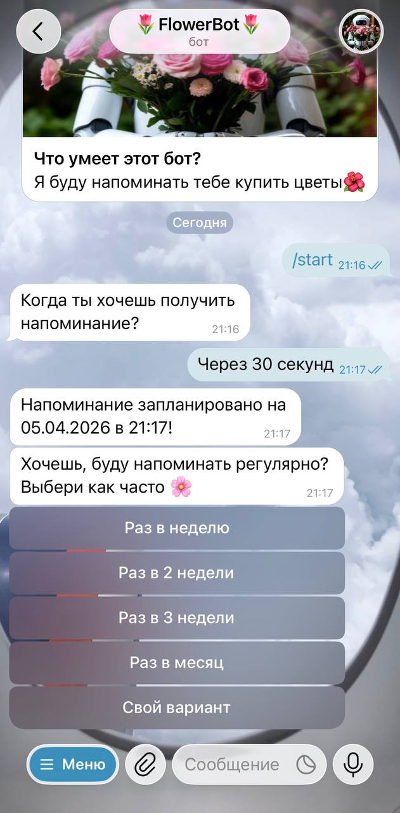

# 🌷 Flower Bot

Telegram-бот, который помогает не забывать покупать цветы - автоматически напоминает в нужное время и по расписанию.  
 <p>


 </p> 

---

## 📌 О проекте

**FlowerBot** - это Telegram-бот, который помогает не забывать о важных мелочах ❤️  
Он автоматически напоминает пользователю купить цветы и поддерживать регулярность заботы.

📍 Основная идея: автоматизация "внимания" через удобные напоминания.

---
## 🤖 Try it

👉 https://t.me/FlowerRemBot

---

## ✨ Возможности

* 📅 Планирование напоминаний в свободном формате
  (например: *"завтра"*, *"5 мая"*, *"через час"*)
* 🔁 Регулярные напоминания (раз в неделю / месяц / свой интервал)
* ✏️ Управление текущими напоминаниями
* ⏳ Быстрое откладывание (на час или на день)
* ✅ Подтверждение покупки с автопланированием следующего напоминания
* 📊 Проверка статуса напоминаний
* ❌ Отмена всех напоминаний


---

## 🧠 Как это работает

1. Пользователь запускает бота (`/start`)
2. Выбирает дату напоминания
3. Указывает периодичность
4. Бот отправляет напоминания и управляет ими через кнопки

---

## 🛠️ Технологии

* Python 3.11
* python-telegram-bot
* SQLite
* dateparser (парсинг дат на естественном языке)
* pytz (таймзоны)

---

## 💬 Команды

| Команда   | Описание                            |
| --------- | ----------------------------------- |
| `/start`  | Начать работу и создать напоминание |
| `/status` | Проверить текущие напоминания       |
| `/cancel` | Удалить все напоминания             |

---

## 🔁 Логика напоминаний

* Напоминание можно:

  * подтвердить (кнопка "Купил")
  * отложить на час или день
  * перейти к доставке цветов
* После подтверждения:

  * автоматически планируется следующее напоминание
* Интервал можно задать вручную или выбрать из предложенных

---

## 🗄️ Структура проекта

```
.
├── bot.py           # Точка входа
├── handlers.py      # Логика Telegram-бота
├── scheduler.py     # Планирование напоминаний
├── database.py      # Работа с SQLite
├── config.py        # Конфигурация 
├── constants.py     # Константы и тексты
├── requirements.txt
└── .env
```

---

## 🧪 Пример сценария

1. `/start`
2. → выбрать "Запланировать"
3. → ввести: `завтра`
4. → выбрать интервал (например, раз в неделю)
5. 🎉 Готово — бот будет напоминать автоматически

---

## 🚀 Demo

<p align="center">
  <b>User flow</b>
</p>

<table align="center">
  <tr>
    <td align="center">
      <br/>
      <sub><b>Start</b></sub>
    </td>
    <td align="center">
      <br/>
      <sub><b>Repeat</b></sub>
    </td>
  </tr>
  <tr>
    <td align="center">
      <br/>
      <sub><b>Reminder</b></sub>
    </td>
    <td align="center">
      <br/>
      <sub><b>Status</b></sub>
    </td>
  </tr>
</table>

---

## 📊 Хранение данных

Используется SQLite с таблицей:

* `chat_id` — ID пользователя
* `next_remind_date` — дата следующего напоминания
* `interval_days` — интервал повторения

---

## 🔄 Восстановление после перезапуска

При запуске бот:

* загружает пользователей из БД
* восстанавливает все активные напоминания

---

## ⚠️ Ограничения

* Часовой пояс фиксирован (по умолчанию Europe/Moscow)
* Максимальный интервал - 365 дней
* Требуется активный Telegram-чат

---
## 📈 Возможные улучшения
* 💳 Интеграция с сервисами доставки цветов
* 📍 Геолокация и подбор магазинов
* 🤖 AI-рекомендации (когда дарить цветы)
* 📊 Аналитика активности пользователей
